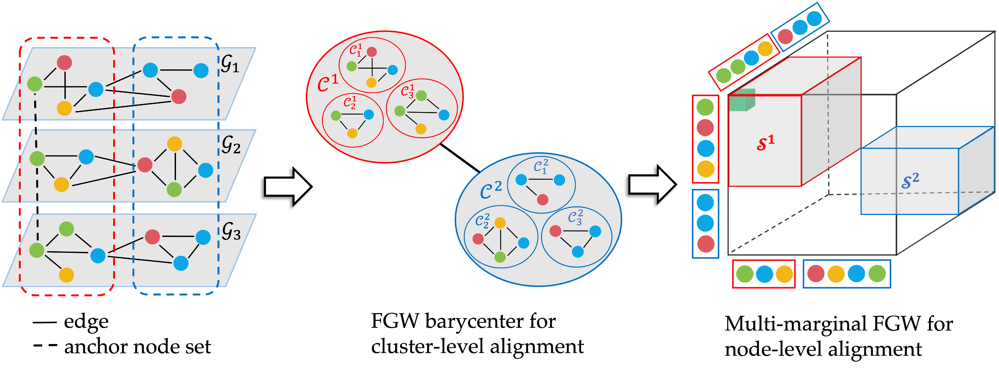
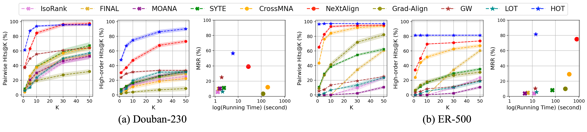
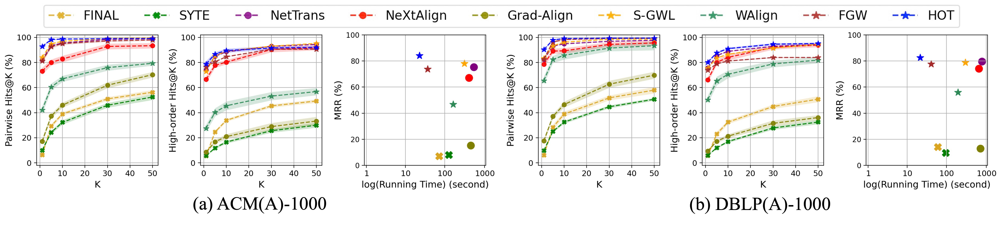

# Hierarchical Multi-Marginal Optimal Transport for Network Alignment

## Overview

Implementation of [Hierarchical Multi-Marginal Optimal Transport for Network Alignment](https://arxiv.org/pdf/2310.04470.pdf) in AAAI 2024.
<p align="center">
  
</p>

**prerequisites**
- pot>=0.9.0
- numpy>=1.22.4
- scikit-learn>=1.1.2

**code**
- ```./src/```: source code to reproduce the experiments
    - ```hot_utils```: utilities for hot, including calculating rwr, cross-graph cost, intra-graph cost, etc.
    -  ```hot```: the main HOT algorithm
    -  ```log_mot```: multi-marginal optimal transport in the log domain
    - ```run_ACM```: Experiments on ACM and ACM(A) datasets
    - ```run_DBLP```: Experiments on DBLP and DBLP(A) datasets
    - ```run_douban```: experiments on Douban-230 dataset
- ```./dataset/```: dataset used for experiments

## How to use
Simply run the ```run_ACM.py```, ```run_DBLP.py```, and ```run_douban.py``` to reproduce the experiment results.

## Experiment Results
<p align="center">
  
</p>
<p align="center">
  
</p>


## Reference
If you find this paper helpful to your research, please kindly cite the following paper:
```
@misc{zeng2023hierarchical,
      title={Hierarchical Multi-Marginal Optimal Transport for Network Alignment}, 
      author={Zhichen Zeng and Boxin Du and Si Zhang and Yinglong Xia and Zhining Liu and Hanghang Tong},
      year={2023},
      eprint={2310.04470},
      archivePrefix={arXiv},
      primaryClass={cs.LG}
}
```